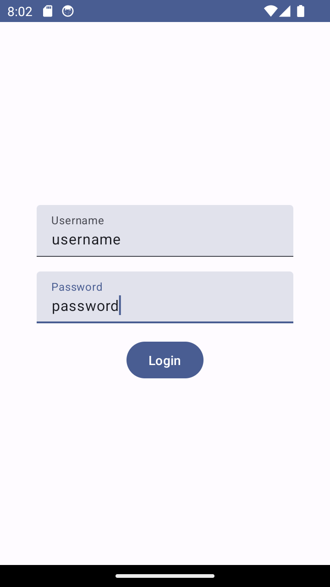
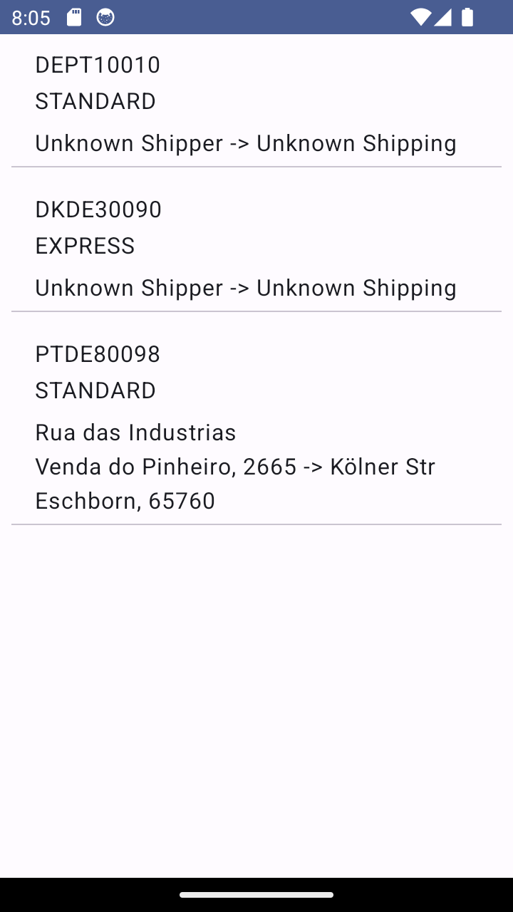
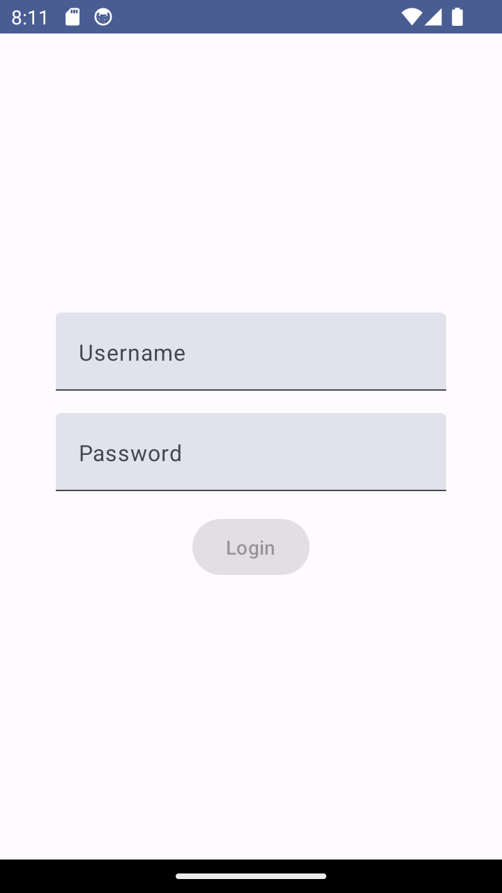
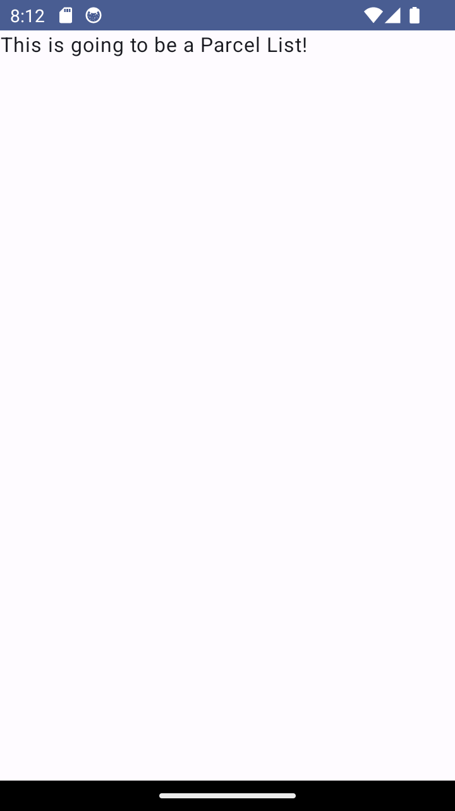
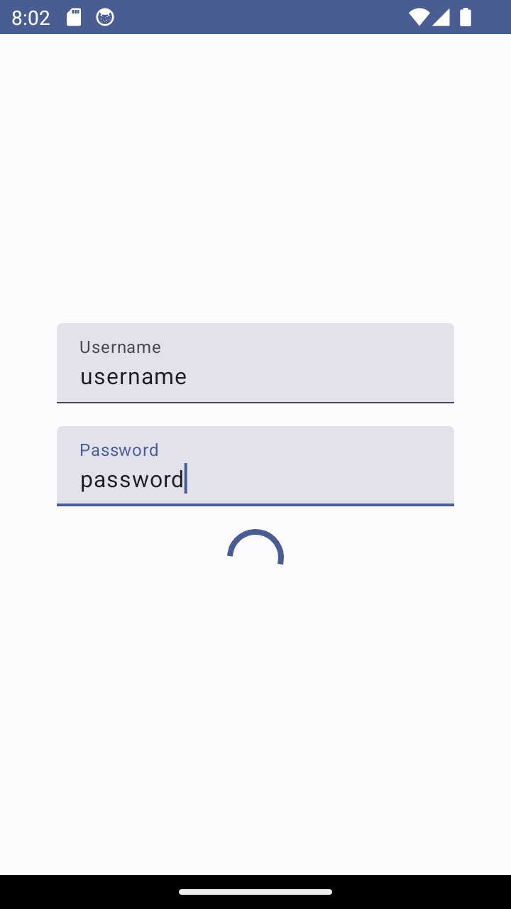
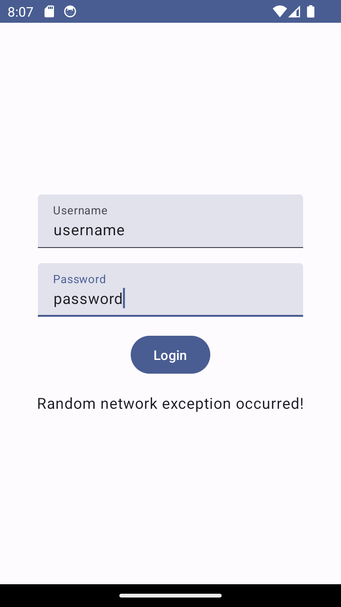
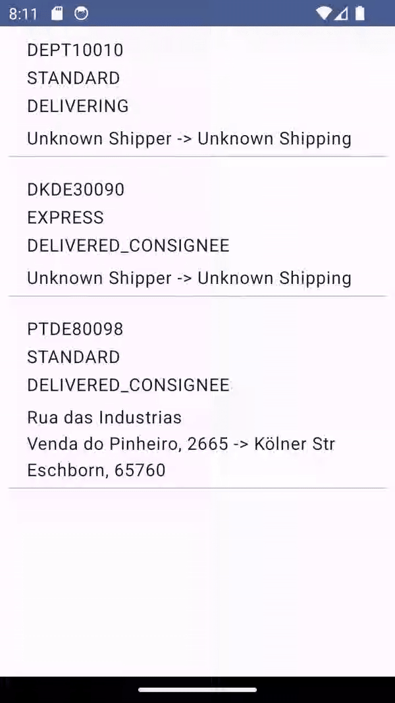
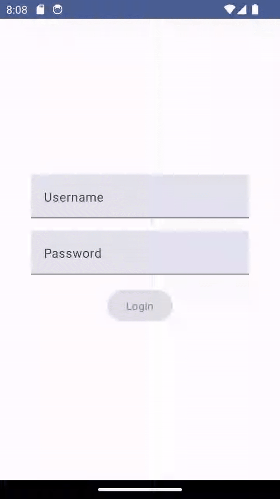

# EXERCISE OVERVIEW

We are going to build an app composed by two composables:
- **LoginScreen** – displays a form to login into the app
- **ParcelListScreen** – displays a list of Parcels to deliver (hardcoded)

 

## EXERCISE 1 - Compose & Navigation

Design a basic UI using Jetpack Compose. Follow these steps:
- **Basic UI**: Build a screen with two TextField components for username and password input, and a Button to submit and log in.
- **Interaction and State Management**: Implement interaction logic so that the button is enabled only when both text fields are filled.
- **Navigation**: When the login button is clicked, the app navigates to the Parcel List screen that displays a simple message ("This is going to be a Parcel List!").

 

## EXERCISE 2 - Java & Kotlin interoperability

Showcase interoperability between Java and Kotlin. Here's an outline of tasks:
- **Java**: Create a java class named **Address** with the following fields:
	- **<u>Street</U>**: String
	- **<u>City</u>**: String
	- **<u>Zip code</u>**: String
- **Kotlin**: Create a <u>data class</u> named **Parcel** with the following fields:
	- **<u>Id</u>**: long
	- **<u>Type</u>**: enum of STANDARD, EXPRESS
	- **<u>ShippperAddress</u>**: Address (optional)
	- **<u>ShippingAddress</u>**: Address (optional)
- **Java class**: Create a method named **getFormattedAddress** that return the address fields in the following format:

**[Street] 
[City], [Zip Code]**

- **Hardcoded data**: Create a composable on **Parcel List** screen that presents the information of the following hardcoded **Parcel** object:

## EXERCISE 3 - Dependency Injection

Create the following components:

- **ViewModel and Repository**: Set up a **ViewModel** that relies on a **Repository** for fetching data. The repository should provide a method named **getData** that returns a hardcoded list of Parcels:

| Id | Type | Shipper Address | Shipping Address |
|--|--|--|--|
|DEPT10010  | STANDARD | - | - |
|DKDE30090  | EXPRESS | - | - |
|PTDE80098  | STANDARD | **<u>Street</u>**: Rua das Industrias / **<u>City</u>**: Venda do Pinheiro / **<u>Zip code</u>**: 2665 | **<u>Street</u>**: Kölner Str / **<u>City</u>**: Eschborn / **<u>Zip code</u>**: 65760 |

- **Hilt Modules**: Create a **Hilt module** to provide your repository to the **ViewModel** as a Singleton.
- **Usage in Activity**: Inject your **ViewModel** into the main Activity. Fetch the data from the **ViewModel** and display it using a LazyList on **ParcelListScreen** composable. This lazy **<u>should deal with null Addresses</u>**:

## EXERCISE 4 - Coroutines

Simulate data fetching from the network using Coroutines:
- **Fetching Data**: Write a function that simulates fetching data from **ParcelRepository** as if it was an API endpoint. This might be as simple as a function that includes delay for a few seconds before returning the list of Parcels.
- **Loading Indicator**: Show a loading indicator on the UI after the user presses the button and until the data is fetched and displayed.
- **Handle Exceptions**: Introduce a random possibility of the data fetch failing and throwing an exception. Use exception handling in your Coroutine to display a failure message (“Random network exception occurred!") to the user when this happens.

 

## EXERCISE 5 - Flows

Now, let’s simulate that we have multiple drivers delivering parcels, who update the parcel's status in real-time. Whenever they update any parcel's status, we want to see a real-time status update on **Parcel List** screen. Here’s outline of what is intended:

- Add **status** field to **Parcel** object:
  - **<u>Status</u>**: enum of IN_DEPOT, DELIVERING, DELIVERED_CONSIGNEE, DELIVERED_PARCEL_SHOP
- **ParcelViewModel** should expose a Flow that emits the same list of parcels every 2 seconds to simulate the real-time data of tracking parcels.
- **ParcelListScreen** observes **ParcelViewModel**'s Flow, updates the UI every time a new list is received.

## EXERCISE 6 - Room

Build a **Room** database to store, update and retrieve parcel details. Here’s the outline of tasks:
- Create a **Room** database named **ParcelDatabase** with **ParcelRoom** as the entity.
- Design a **DAO (Data Access Object)** named **ParcelDao**, which provides methods to perform CRUD operations like **insertParcel, updateParcel, deleteParcel, getParcelById** and  **getAllParcels**.
- Implement a **Repository** (ParcelRepositoryRoom) to serve as an API towards the rest of the application and encapsulate the data sources.
- Create a **ViewModel** (ParcelViewModelRoom)  that  connects the UI and database using the **Repository** and provides the parcel information as LiveData.
- Use the **ViewModel** to insert all parcels on **Room** database. You can do that on **onCreate** method from **MainActivity**.
- Load all parcels from the database on **Parcel List** screen using the LiveData provided by the **ViewModel**.

**NOTE:** Don’t forget to make all classes injectable using Hilt

## EXERCISE 7 - UI Testing

Write a simple UI test to:
- Enter text into **username** and **password** fields in the Login screen.
- Click the login button in the **Login** screen and verify that it navigates to the **Parcel List** screen.
- On **Parcel List** screen, verify that the list presents 3 elements.

## EXERCISE 8 - Unit Testing

Write a Unit Test to test the **ParcelRepository**. Here are the guidelines:
- You need to create an expected list of Parcels.
- You need to use **Mockito** to mock the Parcel repository.
- Use the mocked **ParcelRepository** to return the expected data list when the function that returns the data is called.
- Finally, you need to implement a test case to compare the returned mocked list with the expected data list.
